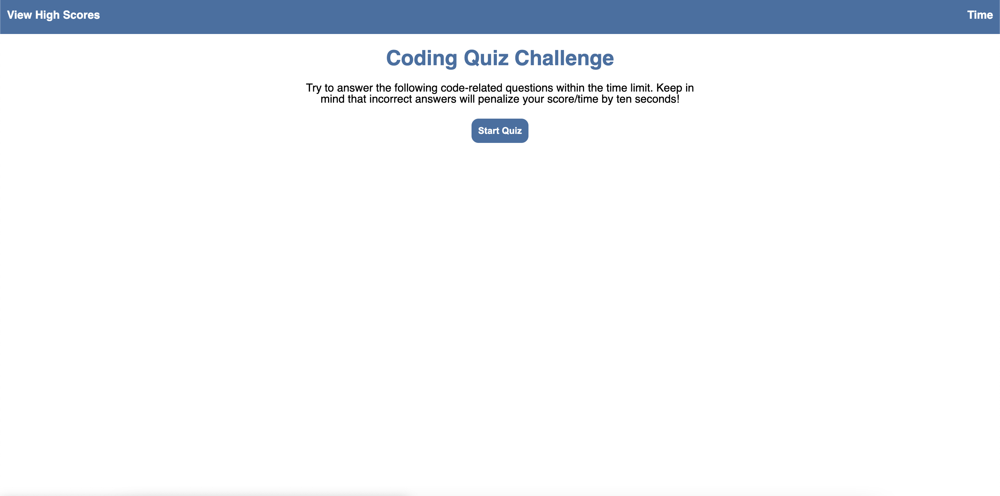
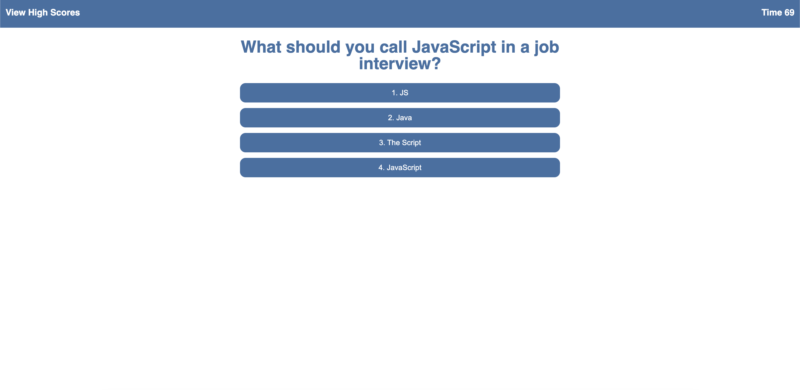
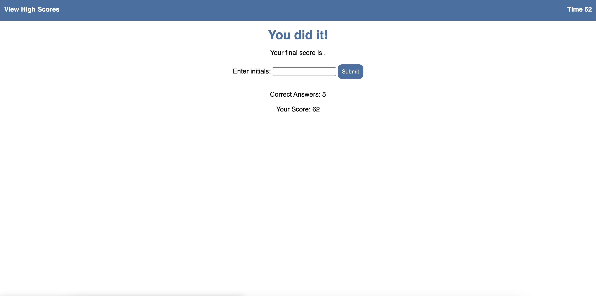

# JavaScript Code Quiz

https://adamalcantara.github.io/code_quiz/

Built with HTML, CSS, and JavaScript

Play this game to gauge your understanding of JavaScript!

When you press the Start button, a series of questions will appear, each with four options.  If you select the correct answer, great!  If you select an incorrect answer, your time will be deducted by 10 seconds.

Enter your initials at the end of the game to view them on the High Scores page!

Contact:
alcantaradevelopment@gmail.com